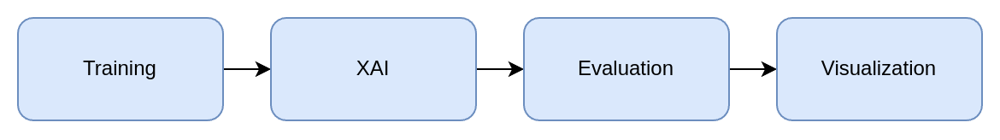

# GECOBench: A Gender-Controlled Text Dataset and Benchmark for Quantifying Biases in Explanations

This repository contains the code for the paper "GECOBench: A Gender-Controlled Text Dataset and Benchmark for Quantifying Biases in Explanations" submitted to NeurIPS 2024 (Datasets and Benchmarks track).

**Abstract:**

Large pre-trained language models have become popular for many applications and form an important backbone of many downstream tasks in natural language processing (NLP). Applying 'explainable artificial intelligence' (XAI) techniques to enrich such models' outputs is considered crucial for assuring their quality and shedding light on their inner workings. However, large language models are trained on a plethora of data containing a variety of biases, such as gender biases, affecting model weights and, potentially, behavior. Currently, it is unclear to what extent such biases also impact model explanations in unfavorable ways. We create a gender-controlled text dataset, GECO, in which otherwise identical sentences appear in male and female forms. This gives rise to ground-truth `world explanations' for gender classification tasks, enabling the objective evaluation of the correctness of XAI methods. We provide GECOBench, a rigorous quantitative evaluation framework benchmarking popular XAI methods, applying them to pre-trained language models fine-tuned to different degrees. This allows us to investigate how pre-training induces undesirable bias in model explanations and to what extent fine-tuning can mitigate such explanation bias. We show a clear dependency between explanation performance and the number of fine-tuned layers, where XAI methods are observed to particularly benefit from fine-tuning or complete retraining of embedding layers. Remarkably, this relationship holds for models achieving similar classification performance on the same task. With that, we highlight the utility of the proposed gender-controlled dataset and novel benchmarking approach for research and development of novel XAI methods.

## Project Structure


The project is structured in the following way:

- `configs/`: Contains the configuration files for the dataset and the project.
- `data/`: Contains the code to generate the **GECO** dataset.
- `training/`: Contains the code to train the different bert models according to the training schemes defined in the config.
- `xai/`: Contains the code to generate the explanations for the different models and explanation methods.
- `evaluation/`: Contains the code to evaluate the explanations and compare them to the ground truth explanations from **GECO**.
- `visualization/`: Contains the code to visualize the evaluation results.

The project can be run locally or on a slurm cluster. The `scripts/` directory contains the scripts to setup the environment and run the code on the cluster.

The benchmark pipeline consists of the following steps:



## Getting Started

All artifacts are available on [OSF](https://osf.io/74j9s/?view_only=8f80e68d2bba42258da325fa47b9010f), including the **GECO** dataset, the trained models, the generated explanations, evaluation results and visualizations. With the artifacts, you can start from any step of the pipeline, by downloading the artifacts and unpacking them in the main directory of the project.

# Building the datasets

Currently we have three datasets: `gender_all`, `gender_subj`, and `sentiment_imdb`.
The config in `config/data_config.json` specifies the datasets and the parameters for the data generation.
The script expects the raw pickle files to be in `data/raw`.

To generate the datasets we can run the following command:

```bash
python generate_data.py --config=./configs/data_config.json
```

This will generate a timestamped folder in the `artifacts/data` directory locally.
To upload the data to the cluster we can use the `copy_data_to_cluster.sh` script. This requires the environment variables to be set in the `.env` file as described below.

```bash
./scripts/hydra/copy_data_to_cluster.sh nlp-benchmark_2024-02-15-10-14-37
```

Lastly, the project config has to be updated to point to the correct data directory in `configs/gender_project_config.json`:

```json
{
  ...
  "data" {
    "data_dir": "/path/to/nlp-benchmark_2024-02-15-10-14-37"
  },
  ...
}
```

# Running experiments locally

1. Setup a experiment run
   This creates a timestamped folder for the artifacts and copies the config files to the folder.

```bash
python setup_experiment.py
```

The output gives you the instructions to run the different steps of the experiment.

2. Run model experiment

Set the mode to `training`, `xai`, `evaluation` or `visualization` and the config to the project config. The modes depend on each other and have to be run in the order `training`, `xai`, `evaluation` and `visualization`.

```bash
python run_experiments.py --mode=MODE --config=artifacts/xai-nlp-benchmark-2024-02-15-16-45-19/configs/gender_project_config.json
```

# On hydra

To run the code on the cluster we have to do three steps:

## Step 1: Setup environment

Copy the `.env.example` file to `.env` and fill in the environment variables.
The script assumes you have added lazy access to hydra in your ssh config, as described in the hydra documentation.
https://git.tu-berlin.de/ml-group/hydra/documentation

```
HYDRA_SSH_USER=hjalmar
HYDRA_DATA_DIR=/home/space/datasets/xai_nlp # The path where to place the data on the cluster
HYDRA_PROJECT_DIR=/home/space/uniml/hjalmar/xai-nlp-benchmark # The path to the code on the cluster
KNOWN_HOSTS=/home/hjall/.ssh/known_hosts
```

## Step 2: Move the code to the cluster

Either clone the remote repository (recommended) or use the `upload_code_to_cluster.py` script.

```bash
python ./scripts/hydra/upload_code_to_cluster.py hydra
```

## Step 4. Setup the project

Ssh into the cluster and navigate to the code directory.
As mentioned above, this creates a timestamped folder for the artifacts and copies the config files to the folder.

```bash
python3 setup_experiment.py
```

By default it will create the artifacts folder in the code directory.

## Step 5. Build and run the container

To run the code we need to first build the container. This step only needs to be repeated if the dependencies change.

```bash
python3 ./scripts/hydra/submit_hydra_job.py --mode build --config ./artifacts/xai-nlp-benchmark-2024-02-15-16-45-19/configs/sentiment_project_config.json
```

Afterwards we can run the container with the following command:

```bash
python3 ./scripts/hydra/submit_hydra_job.py --mode training --config ./artifacts/xai-nlp-benchmark-2024-02-15-16-45-19/configs/sentiment_project_config.json
```

Again, the mode depends on the previous steps and has to be run in the order `training`, `xai`, `evaluation` and `visualization`.

The machine the code is run on and the timeslot can be configured in `./scripts/hydra/cluster_job_hydra_gpu.sh`.
Further details can be found in the hydra documentation: https://git.tu-berlin.de/ml-group/hydra/documentation
The logger outputs of the container can be found in the code directory under logs.

## Step 4. View and cancel jobs

To view your current jobs: run e.g. `squeue --user=hjalmar`
To cancel a job run `scancel job_id` with the job id you get from the command above.

## Step 5. Retrieve results

To copy the results from the cluster to your local machine you can use the `get_results_from_cluster.sh` script.

```bash
./scripts/hydra/get_results_from_cluster.sh xai-nlp-benchmark-2024...
```

# Viewing the html plots

To view the html plots start a local server in the root directory of the project:

```bash
python -m http.server 9000
```

Then navigate to `http://localhost:9000` in your browser, go to the artifacts folder for the run, select the visualization folder and click on the html file.
